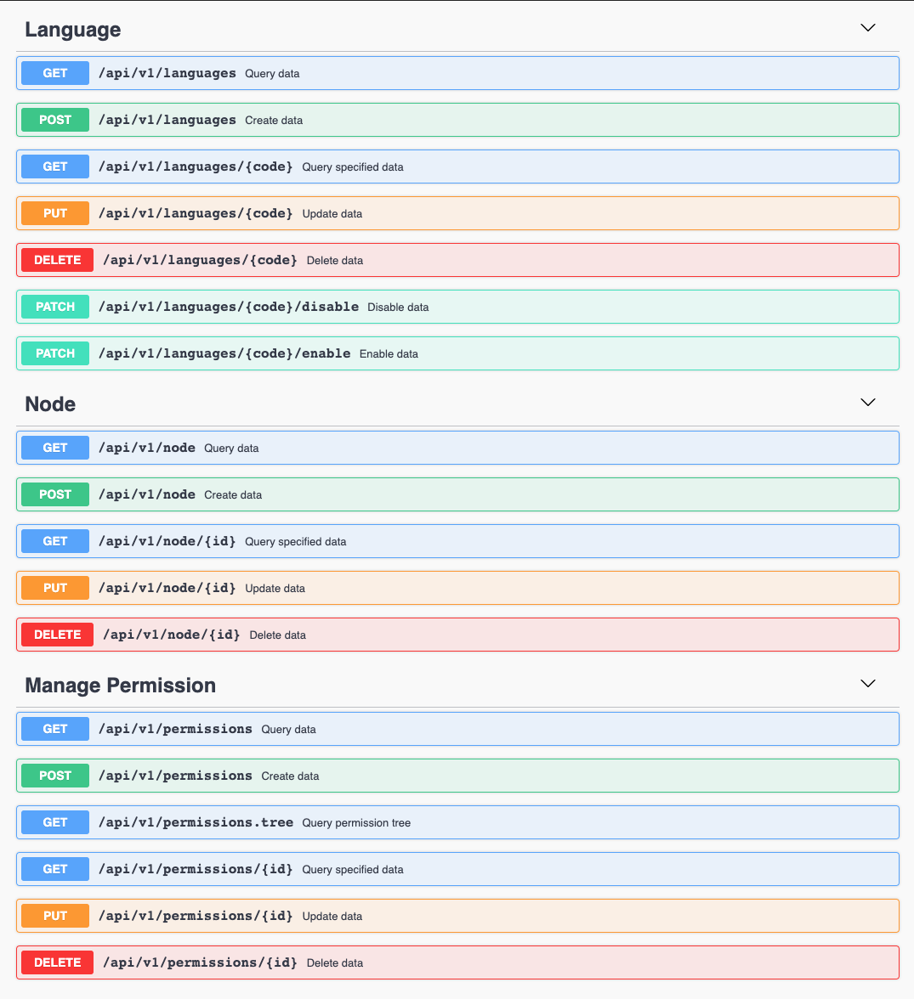

# MayCMF Core

May CMF Serverless CMF writen on GO

RBAC scaffolding based on Gin + GORM + Casbin + Dig. The goal is to provide a lightweight front-end and back-end development framework to facilitate the rapid development of business requirements.
<br/>


## Features

- Following the RESTful API design specification
- [Casbin](https://casbin.org/) based RBAC access control model
- Based on the [GIN WEB](https://gin-gonic.com/) framework, it provides rich middleware support (user authentication, cross-domain, access logs, request frequency limit, tracking ID, etc.)
- JWT authenticate (Blacklist-based authentication mode, storage support: file/redis)
- Database storage based on GORM (the storage layer uses external interfaces for the business layer to invoke, which completely isolates the storage layer)
- Dependency injection - based on [dig](http://go.uber.org/dig)
- Log tracking - based on [logrus](https://github.com/sirupsen/logrus), log hook support GORM.
- [Swagger](https://swagger.io/) documentation - based on [swaggo](https://github.com/swaggo/swag)
- Unit testing - based on `net/http/httptest` package, covering all interface layer tests.
<p>



## Quick start

> Use [mash](https://github.com/MayCMF/mash) tool for quick clean instalation and generate addons

### Quick create and run projects

```bash
$ go get -u github.com/MayCMF/core
$ cd ~/go/src/github.com/MayCMF/core
$ go run cmd/server.go
```

> After the startup is successful, you can enter the address access in the browser: [http://localhost:8088/swagger/](http://localhost:8088/swagger/)


## Manually download and run

### Get code

```bash
$ git clone git@github.com:MayCMF/core.git
```

### Run

#### Running service


```bash
$ cd ~/path/to/cloned/directory
$ go mod vendor
$ go run cmd/server.go
```

> After a successful start, you can enter the address in the browser to access:
[http://localhost:8088/swagger/](http://localhost:8088/swagger/)

#### Reminder

1. The default configuration uses the **sqlite3** database, and the database file (`automatically generated`) is in `data/MayCMF.db`. If you want switch to `mysql` or `postgres`, change the configuration file.
2. The default configuration of the log is standard output. If you want to switch to write to a file or write to gorm storage, you need change configurations by yourself: `configs/config.toml`.

## Front-End

Comming soon ....

## Use Swagger documents

> For document rules, please refer to: [https://github.com/swaggo/swag#declarative-comments-format](https://github.com/swaggo/swag#declarative-comments-format)

### Install tools and generate documentation

```bash
$ go get -u -v github.com/swaggo/swag/cmd/swag
$ swag init -g ./src/[COMPONENT]/routers/swagger.go -o ./docs/swagger
```

Once the document is generated, you can enter the address in your browser:[http://localhost:8088/swagger/](http://localhost:8088/swagger/)

